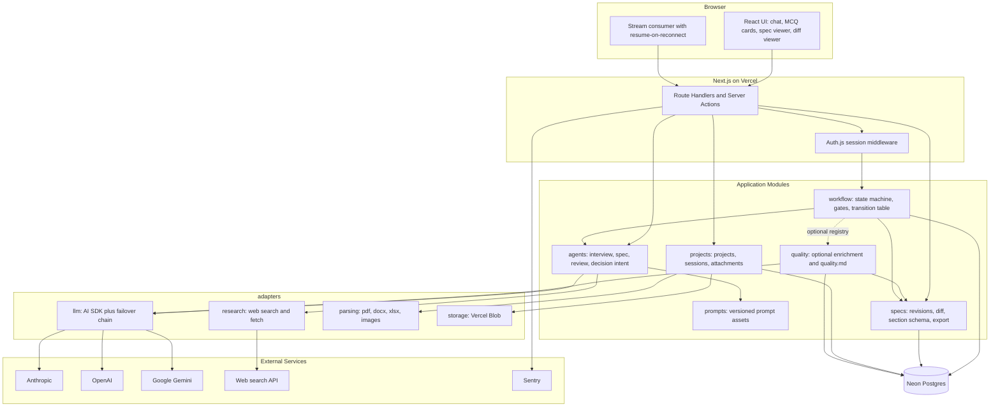
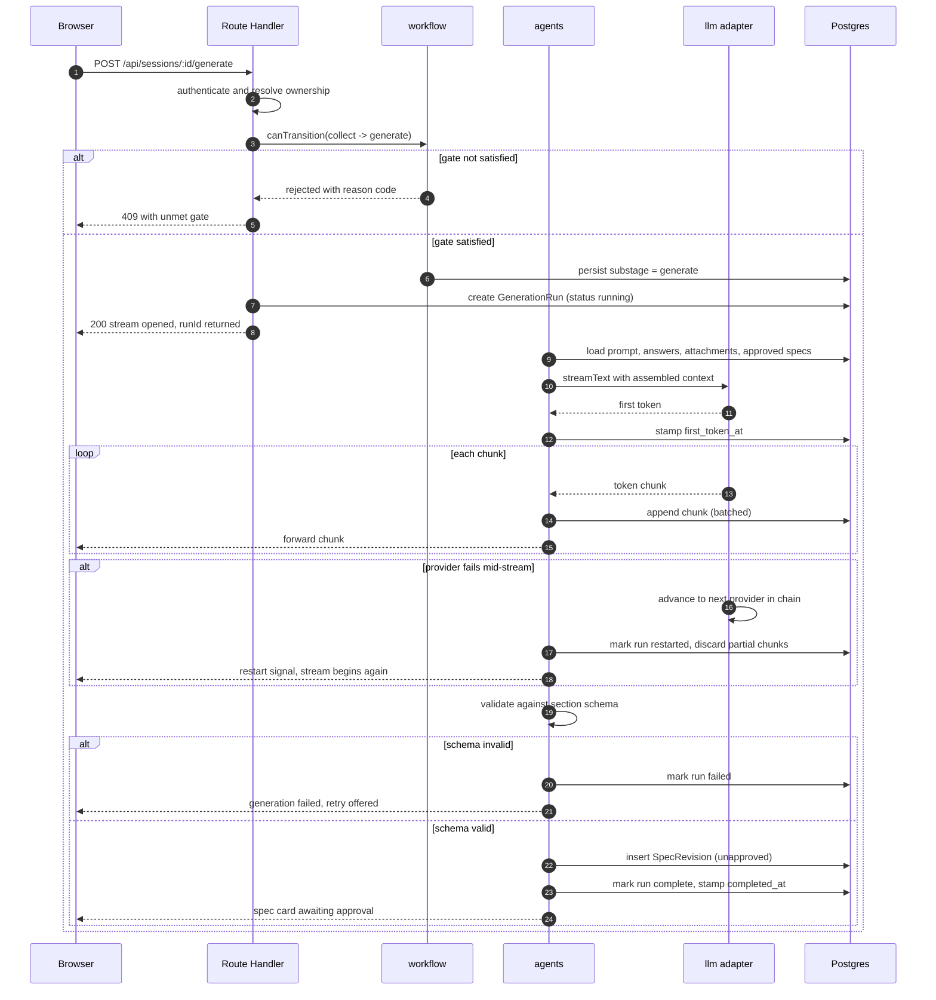
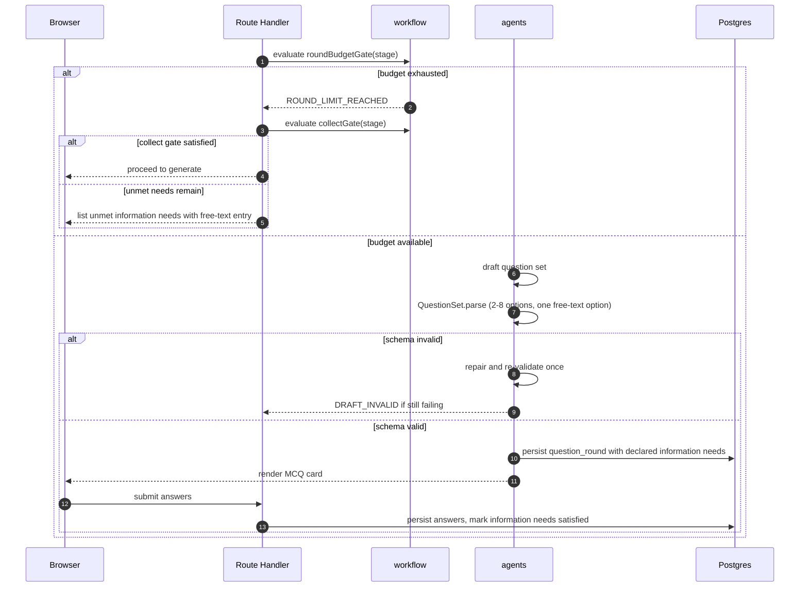
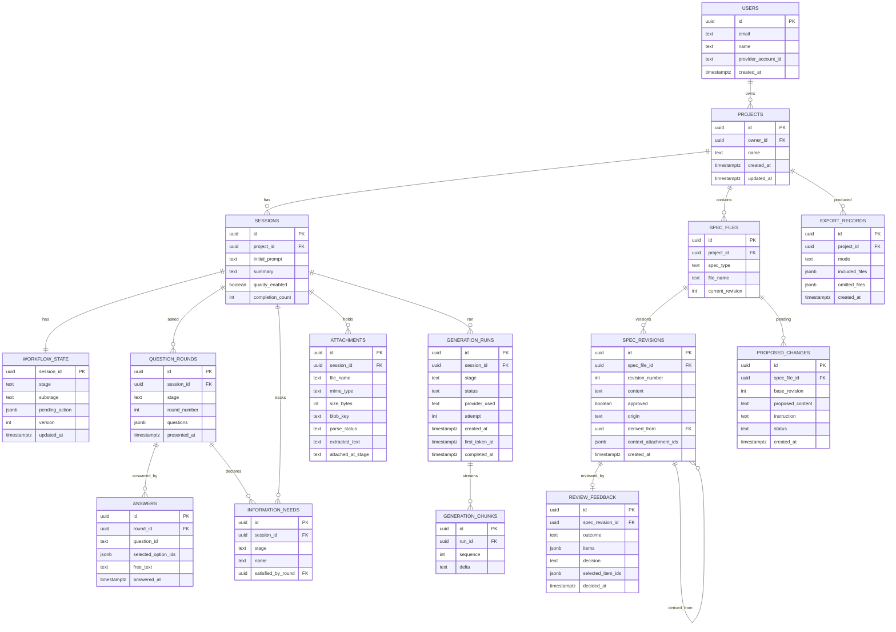
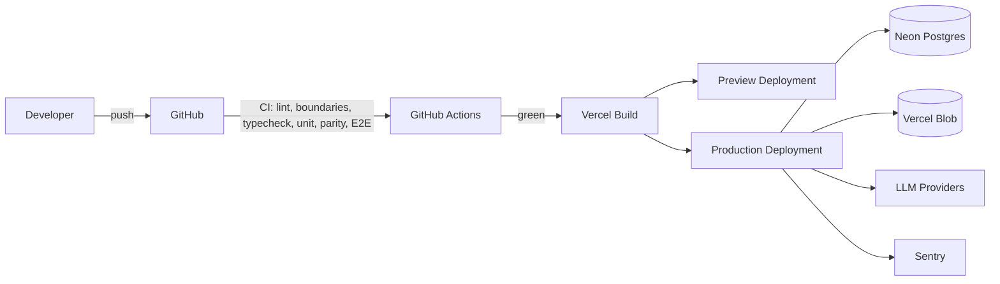

# Solution Design — Spec Platform (MySpec-class SDD Tool)

> Governed by `constitution.md`; implements `requirements.md`. Where this document conflicts with either, they win in that order.

## Overview

### Description

The platform is a **modular monolith** deployed as a single Next.js application on Vercel. A user signs in with OAuth, submits a plain-language prompt, and is guided through a code-enforced workflow — `interview → constitution → requirements → solution → tasks → (quality) → complete` — where each specification stage runs `collect → generate → review` with human approval at every gate. Generated markdown is persisted as immutable revisions and exported as a ZIP bundle.

The architecture is organised around one hard separation: **the workflow engine decides what happens next; the model only produces content.** The engine is a pure TypeScript state machine with an explicit transition table, evaluable without I/O, and testable without a model, a database, or a browser. Everything non-deterministic — model calls, web research, document parsing — is pushed behind adapter interfaces at the edges.

The optional Quality stage lives in its own module behind a feature-flagged registration seam, so the parity generation path is byte-identical whether or not it is installed.

Long generations stream token-by-token from a single long-running route handler. Every stream is assigned a durable `GenerationRun` whose chunks are appended to Postgres, so a dropped connection replays what was missed and re-attaches to the live stream rather than restarting the generation.

### Technology Stack

| Layer | Technology | Rationale |
|---|---|---|
| Framework | **Next.js (App Router)** | Mandated by constitution; server-side model calls, route handlers, streaming responses in one deployable. |
| Language | **TypeScript, `strict: true`** | Mandated. No `any`, no unchecked casts. |
| UI | **React + Tailwind CSS + shadcn/ui** | Components are vendored into the repo, so there is no third-party runtime to track and no upgrade coupling. |
| Hosting | **Vercel** | Native App Router support; Fluid compute gives the long function durations streaming needs. |
| Database | **Neon serverless Postgres** | Plain Postgres over HTTP/WebSocket driver — no connection-pool exhaustion from serverless invocations, and no proprietary data layer to migrate away from later. |
| ORM | **Drizzle ORM** | SQL-shaped, fully typed, no query engine binary, migrations are checked-in SQL files. Serverless cold-start cost is negligible compared to Prisma's engine. |
| Validation | **Zod** | Mandated at all external and model boundaries; shared schema types between server and client. |
| Auth | **Auth.js (NextAuth)** with Google + GitHub | Open source, self-contained, database-session capable; no identity vendor in the critical path. |
| LLM access | **Vercel AI SDK** with `@ai-sdk/anthropic`, `@ai-sdk/openai`, `@ai-sdk/google` | One `LanguageModel` interface across all three providers, streaming and tool calling included. Satisfies constitution P7 without hand-writing three adapters. |
| Object storage | **Vercel Blob** (private access) | Native to the platform; signed, owner-scoped access; deletion is a single call in the project-delete cascade. |
| Document parsing | Per-format server libraries (`unpdf`, `mammoth`, `xlsx`); images forwarded to vision-capable models | No third-party parsing service in the data path; documents never leave our infrastructure. |
| Module boundaries | **ESLint `import/no-restricted-paths`** (or `eslint-plugin-boundaries`) | Constitution A1 requires boundaries enforced by lint, not convention; violations fail the build. |
| Testing | **Vitest** (unit) + **Playwright** (E2E) | Vitest shares the Vite/TS toolchain and runs the pure engine fast; Playwright covers the prompt→ZIP journey across supported browsers. |
| Monitoring | **Sentry** (errors only) | Minimal scope per constitution: crashes and exhausted-failover generation failures. |

### Design Decisions Summary

1. **Pure state machine, explicit transition table.** Every legal transition is a table row; every gate is a pure predicate over persisted state. Illegal transitions return a typed rejection reason.
2. **Question sets are schema-constrained, not model-discretionary.** Option counts, the mandatory free-text escape, and the per-stage round budget are enforced by Zod and by a workflow gate.
3. **Provider abstraction via the AI SDK, failover in our own layer.** The SDK normalises providers; an ordered failover chain and retry policy sit above it, because failover is our availability requirement, not the SDK's.
4. **Durable streaming.** Each generation is a `GenerationRun` with an append-only chunk log; resume replays from the last delivered sequence number.
5. **Proposed changes are not revisions.** Conversational refinements live in a `proposed_changes` table until the user accepts the diff; only acceptance writes a `spec_revisions` row.
6. **Section schema is one module.** `specs/section-schema.ts` is imported by prompt assembly and by the parity test — the only source of required headings.
7. **Quality is an optional, removable module.** It registers through a capability interface; with the flag off, no Quality code participates in generation or export.
8. **Decisions may be typed, not only clicked.** A deterministic classifier maps chat-typed decisions onto the same endpoints the cards use; ambiguity leaves the card pending.
9. **Export resolves against a declared mode**, not against the latest revision, so a default-mode export is byte-identical in structure even after enrichment.
10. **Ownership is enforced in the data-access layer**, not in route handlers, so no query can accidentally omit it.
11. **Module boundaries are lint-enforced**, so a forbidden cross-module import is a build failure rather than a review comment.

## High-Level Architecture Design

The browser holds no secrets and makes no model calls. All privileged work happens in server-side route handlers and server actions. The `workflow` module is the only component permitted to change a session's stage; `agents` may propose content but never control flow. The `quality` module is the only optional participant, attached through a registry that is empty when the feature flag is off. All non-deterministic external work is confined to the adapter layer.



### Generation Sequence

The critical path — a stage generation with failover and durable streaming — involves the client, route handler, workflow engine, agent, LLM adapter, and persistence. The gate is checked **before** any model call, so a rejected transition costs nothing.



### Interview Round Sequence

Question sets are validated before they reach the user, and the per-stage round budget is a gate rather than a model instruction.



## System Modules

### Module: `workflow`

**Responsibilities**

- Owns the canonical stage/substage model and the explicit transition table.
- Evaluates every gate as a pure predicate over a `WorkflowSnapshot`.
- Enforces the per-stage question-round budget.
- Rejects illegal transitions with a typed, machine-readable reason.
- Consults the optional capability registry to decide whether `tasks → quality` is a legal row.
- Is the **only** module permitted to write `workflow_state`.

**Key Components**

| Component | Purpose |
|---|---|
| `transitionTable` | Static array of `{ from, to, gate, id }` covering every legal transition, including `complete → quality`. |
| `gates` | Pure predicates: `interviewGate`, `collectGate`, `roundBudgetGate`, `approvalGate`, `reviewGate`, `completionGate`. |
| `roundBudgetGate` | `answeredRounds(stage) < MAX_ROUNDS_PER_STAGE` (3). Returns `ROUND_LIMIT_REACHED` when exhausted. |
| `evaluateTransition` | `(snapshot, target) => Allowed \| Rejected<ReasonCode>`; performs no I/O. |
| `applyTransition` | Persists the new state inside a transaction after `evaluateTransition` allows it. |
| `capabilityRegistry` | Set of registered optional stage capabilities; empty when the Quality flag is off. |
| `WorkflowSnapshot` | Plain data assembled by a repository: current stage/substage, answered rounds per stage, satisfied information needs, spec approval flags, review decisions, quality flag, registered capabilities. |

**Key Interfaces**

```ts
type ReasonCode =
  | 'INTERVIEW_INCOMPLETE' | 'NO_ANSWERED_ROUND'  | 'SPEC_NOT_APPROVED'
  | 'REVIEW_NOT_DECIDED'   | 'SPEC_MISSING'       | 'TRANSITION_NOT_IN_TABLE'
  | 'SESSION_SEALED'       | 'ROUND_LIMIT_REACHED'| 'CAPABILITY_NOT_REGISTERED'
  | 'REVISION_LIMIT_REACHED'; // амендмент А-5: бюджет revision-циклов стадии (задача 113); висит на решении request_changes, обратное ребро review→generate остаётся безусловным (FR-007 AC-5)

interface TransitionResult { allowed: boolean; reason?: ReasonCode; }

interface StageCapability {
  id: 'quality';
  isEnabled(snapshot: WorkflowSnapshot): boolean;
}

function evaluateTransition(s: WorkflowSnapshot, to: StagePosition): TransitionResult;
function applyTransition(sessionId: string, to: StagePosition): Promise<WorkflowState>;
function canAskAnotherRound(s: WorkflowSnapshot, stage: SpecStage): TransitionResult;
```

**Data Models**

`workflow_state` (session_id, stage, substage, pending_action, version, updated_at). Snapshot is derived, never stored twice.

**Dependencies**

Repository interfaces only (injected), plus the capability registry as plain data. No dependency on `agents`, `llm`, `quality`, `adapters`, or `web` — the engine must be constructible in a test with plain objects (NFR-012 AC-2).

**Error Handling**

Rejections are values, not exceptions. `applyTransition` is transactional with an optimistic version check; a concurrent transition fails with `CONFLICT` and the client refetches rather than double-advancing. A `tasks → quality` request when no capability is registered returns `CAPABILITY_NOT_REGISTERED`.

---

### Module: `agents`

**Responsibilities**

- Runs the per-stage agent: interview questioner, spec writer, reviewer.
- Assembles context (prompt, answers, attachment text, approved specs) and invokes the model.
- Emits structured artifacts: question sets, spec markdown, review feedback.
- Resolves chat-typed decisions into the same actions the decision cards emit.
- Validates every structured artifact against a Zod schema before it is persisted or shown.
- Never decides stage order (constitution P1).

**Key Components**

| Component | Purpose |
|---|---|
| `InterviewAgent` | Produces question rounds with declared information needs; output must satisfy `QuestionSetSchema`. |
| `SpecAgent` | Produces markdown for the current stage; validates against the section schema before returning. |
| `ReviewAgent` | Produces `{ verdict, summary, mustFix[], recommendations[] }` (review.v2, А-5) with a stable `id` on every feedback item; parsing follows Р-1 (outermost JSON → repair once → one full re-sample). |
| `RevisionAgent` | Revises an approved spec from a **filtered** feedback set — only the items the user selected. |
| `DecisionIntentResolver` | Maps a chat-typed message onto a pending decision (FR-009 AC-7): deterministic pattern match first, single-shot model classification only if that is inconclusive. |
| `ContextAssembler` | Builds the context window from persisted state, with deterministic ordering and size budgeting. |
| `ResearchTool` | Tool wrapper exposing the `research` adapter to agents. |

**Question Set Contract**

`QuestionSetSchema` is the enforcement point for FR-005 AC-2/AC-3. A draft that fails validation is repaired once and, if it still fails, is discarded with `DRAFT_INVALID` — an invalid question set is never persisted or rendered.

```ts
const QuestionOption = z.object({
  id: z.string().min(1),
  label: z.string().min(1),
  description: z.string().optional(),
});

const Question = z.object({
  id: z.string().min(1),
  text: z.string().min(1),
  type: z.enum(['single', 'multiple']),
  options: z.array(QuestionOption).min(2).max(8),
  allowOther: z.literal(true),          // FR-005 AC-3: the free-text escape is mandatory
  informationNeeds: z.array(z.string().min(1)).min(1),
});

const QuestionSetSchema = z.object({
  stage: SpecStageEnum,
  questions: z.array(Question).min(1).max(5),
});
```

The free-text "other" entry is rendered by the client from `allowOther`, so exactly one such entry exists per question and the agent cannot author a competing option that duplicates it.

**Decision Intent Contract**

A pending spec or review decision may be resolved from the card **or** from a typed message (FR-009 AC-7, FR-010 AC-4). Resolution is deliberately conservative: the model is never allowed to invent a decision the user did not express.

```ts
type PendingKind = 'spec' | 'review' | 'diff';

const DecisionIntent = z.object({
  kind: z.enum(['spec', 'review', 'diff']),
  action: z.enum(['approve', 'reject', 'accept', 'ignore', 'update']),
  editPrompt: z.string().optional(),      // required for reject / update
  confidence: z.number().min(0).max(1),
});

function resolveDecisionIntent(
  message: string, pending: PendingKind,
): Promise<DecisionIntent | null>;      // null => leave the card pending
```

Resolution order:

1. **Deterministic match** against a curated phrase set per action, in the session's language. A hit is applied immediately with no model call.
2. **Model classification** only when step 1 is inconclusive, constrained to the `DecisionIntent` schema.
3. **Abstain.** Confidence below threshold, or a message that reads as a question, yields `null`: the assistant answers the question in text and the pending card is re-presented unchanged.

A resolved intent is dispatched to exactly the same endpoint the card would have called, so there is one code path per decision and the audit trail is identical.

**Key Interfaces**

```ts
interface AgentResult<T> { artifact: T; runId: string; }

interface SpecAgentInput {
  sessionId: string; stage: SpecStage; snapshot: WorkflowSnapshot;
  selectedFeedbackIds?: string[];       // FR-010 AC-7: only these items are applied
  onChunk: (text: string) => void;
}

function runSpecAgent(i: SpecAgentInput): Promise<AgentResult<{ markdown: string }>>;
function runInterviewAgent(i: InterviewAgentInput): Promise<AgentResult<QuestionSet>>;
```

When `selectedFeedbackIds` is present, `ContextAssembler` includes **only** those feedback items in the revision prompt; unselected items are omitted entirely rather than being marked optional, so an unselected recommendation cannot leak into the revision.

**Data Models**

Writes `generation_runs`, `generation_chunks`, `question_rounds`, `information_needs`; writes `spec_revisions` only on successful schema validation.

**Dependencies**

`prompts`, `adapters/llm`, `adapters/research`, `specs` (for the section schema), `projects` (for attachment text), `workflow` (read-only snapshot).

**Error Handling**

- Provider error → delegated to `llm` failover; the agent sees a single logical call.
- Question-set validation failure → one repair attempt, then `DRAFT_INVALID`; the round is not persisted and the user sees a retry rather than a malformed card.
- Spec schema validation failure → treated as generation failure (FR-008 AC-7); no revision written.
- Decision-intent failure or low confidence → abstain; the pending card remains, never a guessed decision.
- Research failure → swallowed and logged; generation continues (FR-019 AC-4).
- Model output is parsed through Zod before any structured artifact is persisted.

---

### Module: `quality` (optional)

This module implements constitution A6. It is the sole owner of Quality-stage behaviour, and the application is fully functional with it absent.

**Responsibilities**

- Generates `quality.md` (traceability matrix, expanded EARS+ criteria, risk/assumption log).
- Runs the enrichment pass that writes enriched revisions of the four core files.
- Computes enrichment staleness from revision metadata.
- Registers itself as a `StageCapability` so `workflow` may offer `tasks → quality` and `complete → quality`.

**Key Components**

| Component | Purpose |
|---|---|
| `QualityAgent` | Produces `quality.md` from the completed bundle. |
| `EnrichmentPass` | Rewrites the four core files, marking each new revision `origin='enrichment'` with `derived_from` set. |
| `StalenessService` | `isStale(file) = exists(parityRevision.revision_number > enrichment.derived_from)`. |
| `QualityCapability` | The `StageCapability` implementation registered at boot when the flag is on. |
| `TraceabilityBuilder` | Extracts FR/solution/task identifiers from current revisions; refuses to emit a matrix row referencing an identifier absent from the bundle (FR-014 AC-3). |

**Key Interfaces**

```ts
interface QualityCapability extends StageCapability {
  id: 'quality';
  runEnrichment(projectId: string): Promise<SpecRevision[]>;
  generateQualityFile(projectId: string): Promise<SpecRevision>;
  isStale(projectId: string): Promise<boolean>;
}

// specs consumes this optionally; absent registration means "never stale, never enriched"
type QualityPort = QualityCapability | null;
```

**Removal Seam**

- Registration happens once at boot: `QUALITY_STAGE_ENABLED=false` leaves `capabilityRegistry` empty.
- `workflow` filters `tasks → quality` and `complete → quality` out of the legal transition set when no capability is registered, so the state machine collapses to `tasks → complete` with no branching in the parity path.
- `specs.resolveExport` accepts a `QualityPort`; when it is `null`, mode is forced to `'default'` and no staleness query is issued.
- The parity structural check runs the full generation suite with the module unregistered, asserting the four-file output and the absence of any Quality content (constitution A6, P3).

**Data Models**

Writes `spec_revisions` with `origin='enrichment'`; reads `spec_files`, `spec_revisions`. Owns no tables of its own — deliberately, so uninstalling it requires no migration.

**Dependencies**

`adapters/llm`, `prompts`, `specs`. Nothing depends on `quality` at compile time; `workflow` and `specs` depend only on the `StageCapability` / `QualityPort` interfaces, both declared outside this module.

**Error Handling**

- Enrichment failure leaves parity revisions untouched; the bundle remains exportable in default mode.
- A traceability identifier that cannot be resolved aborts the file rather than emitting a dangling reference.
- Stale enrichment causes `EXPORT_STALE` at the export boundary, never a silent fallback to enriched content.

---

### Module: `prompts`

**Responsibilities**

- Stores every prompt as a versioned file asset, referenced by identifier.
- Derives required section lists from `specs/section-schema.ts` rather than restating them.

**Key Components**

`prompts/<agent>/<stage>.md` assets, a `promptRegistry` mapping identifiers to loaded content, and `assemblePrompt(id, vars)` performing typed interpolation.

**Key Interfaces**

```ts
function assemblePrompt(id: PromptId, vars: PromptVars): string;
```

**Data Models**

None persisted; prompts are build-time assets under version control.

**Dependencies**

`specs` (section schema) only.

**Error Handling**

A missing prompt identifier or unfilled variable fails fast at startup/build, not at request time.

---

### Module: `adapters`

All non-deterministic external I/O lives here. Every adapter exposes a narrow interface, owns its timeout and size limits, and has a declared failure mode (IR-X1). Every adapter is substitutable by a test double, so no automated test touches a third party (IR-X4).

#### `adapters/llm`

**Responsibilities** — one interface for message exchange, streaming, and tool calls; provider ordering, timeouts, retry, and failover; no provider-specific type escapes the module.

**Key Components**

| Component | Purpose |
|---|---|
| `providerRegistry` | Configuration-driven ordered list of `{ id, model, priority }`. |
| `FailoverClient` | Wraps AI SDK `streamText`; on error or timeout advances to the next provider. |
| `StreamRecorder` | Buffers chunks and appends them to `generation_chunks` in batches (~250 ms or 2 KB); stamps `first_token_at` on the first delta. |
| `TestDouble` | Deterministic stub used by every automated test (IR-001-AC-5). |

**Key Interfaces**

```ts
interface GenerateOptions {
  messages: ModelMessage[];
  tools?: ToolSet; runId: string;
  onChunk: (text: string) => void;
}

interface GenerateResult { text: string; providerUsed: ProviderId; attempts: number; }

function generateStreaming(o: GenerateOptions): Promise<GenerateResult>;
```

**Data Models** — `generation_runs`, `generation_chunks`.

**Dependencies** — AI SDK provider packages; configuration.

**Error Handling**

- Per-provider timeout (`LLM_REQUEST_TIMEOUT_MS`), then advance in the chain.
- **Mid-stream failure policy:** partial output is discarded, the client receives an explicit `restart` event, and chunks are re-appended from sequence zero for the new attempt. Partial text is never concatenated across providers and never persisted as a revision (FR-018 AC-5).
- All providers exhausted → `AllProvidersFailedError`, surfaced with retry (FR-018 AC-2/AC-3) and reported to Sentry (NFR-010).
- Provider names and raw payloads are stripped from user-facing messages (FR-018 AC-7).

#### `adapters/research`

**Responsibilities** — issue web searches and fetch pages during generation (IR-003), and bound what reaches a model.

**Key Components** — `SearchClient`, `PageFetcher`, `ContentBudget` (truncates to `WEB_FETCH_MAX_BYTES` before hand-off), `UntrustedBlockWrapper` (wraps retrieved text in a labelled untrusted-data block).

**Key Interfaces**

```ts
interface ResearchAdapter {
  search(query: string): Promise<SearchHit[]>;
  fetch(url: string): Promise<{ text: string; truncated: boolean }>;
}
```

**Data Models** — none persisted; retrieved content is transient context only.

**Dependencies** — web search API; configuration.

**Error Handling** — per-request timeout (`WEB_FETCH_TIMEOUT_MS`); any failure or timeout resolves to "no result", is logged as `RESEARCH_UNAVAILABLE`, and generation continues (IR-003-AC-2, FR-019 AC-4). Content exceeding the byte cap is truncated, never streamed whole into the model.

#### `adapters/parsing`

**Responsibilities** — extract text from uploads (IR-004) within bounded time, and record the outcome.

**Key Components** — `PdfExtractor` (`unpdf`), `DocxExtractor` (`mammoth`), `XlsxExtractor` (`xlsx`), `PlainTextExtractor`, `ImagePassthrough` (no extraction; the file is offered to vision-capable models), `ExtractorRegistry` keyed by sniffed MIME type.

**Key Interfaces**

```ts
interface ParsingAdapter {
  extract(input: { blobKey: string; mimeType: string }):
    Promise<{ status: 'ok' | 'failed'; text?: string; reason?: string }>;
}
```

**Data Models** — writes `attachments.parse_status` and `attachments.extracted_text` (DR-8: extraction runs once, not per generation).

**Dependencies** — `adapters/storage`; format libraries.

**Error Handling** — extraction runs under `PARSE_TIMEOUT_MS`; failure or timeout records `parse_status='failed'` with a reason, notifies the owner, and leaves the session usable (IR-004-AC-3, FR-004 AC-5). An unsupported type never reaches an extractor — it is rejected at upload.

#### `adapters/storage`

**Responsibilities** — private object storage for uploads (IR-005), owner-scoped read access, cascade deletion.

**Key Components** — `BlobWriter` (rejects before writing when size or type is invalid), `SignedUrlIssuer` (short-lived URLs issued only after an ownership check), `CascadeDeleter`.

**Key Interfaces**

```ts
interface StorageAdapter {
  put(scope: OwnerScope, file: UploadInput): Promise<{ blobKey: string }>;
  signedUrl(scope: OwnerScope, blobKey: string, ttlSeconds: number): Promise<string>;
  deleteMany(blobKeys: string[]): Promise<void>;
}
```

**Data Models** — `attachments.blob_key` is the only reference; objects are never publicly addressable (IR-005-AC-2).

**Dependencies** — Vercel Blob; configuration.

**Error Handling** — size/type violations raise `UPLOAD_REJECTED` **before** any bytes are written (NFR-008 AC-3). A failed blob delete during project deletion is retried and logged; the database cascade still completes, and orphaned objects are swept by a periodic reconciliation rather than blocking the user's delete.

---

### Module: `specs`

**Responsibilities**

- Owns spec files, immutable revisions, proposed changes, diffing, the section schema, and export.
- Resolves export mode to a concrete revision set.
- Delegates staleness to the optional `QualityPort`.

**Key Components**

| Component | Purpose |
|---|---|
| `section-schema.ts` | The single source of required headings per spec type. |
| `validateStructure` | Asserts headings present and ordered; used by the agent and by the parity test. |
| `RevisionRepository` | Append-only writes; resolves latest, latest-approved, and latest pre-enrichment revisions. |
| `ProposedChangeService` | Creates, diffs, accepts, rejects proposals. |
| `DiffService` | Line-level unified diff for the diff viewer. |
| `ExportService` | Builds the ZIP for a declared mode and returns an omission manifest. |

**Key Interfaces**

```ts
type ExportMode = 'default' | 'quality';

interface ExportResult { zip: Uint8Array; included: SpecFileName[]; omitted: SpecFileName[]; mode: ExportMode; }

function resolveExport(projectId: string, mode: ExportMode, quality: QualityPort): Promise<ExportResult>;
function acceptProposedChange(id: string): Promise<SpecRevision>;
function rejectProposedChange(id: string): Promise<void>;
```

**Data Models**

`spec_files`, `spec_revisions`, `proposed_changes`, `review_feedback`, `export_records`.

**Error Handling**

- A proposal that would delete a required section is refused before it is offered (FR-011 AC-8).
- A second pending proposal on the same file is rejected by a partial unique index, not by application timing (DR-11).
- A Quality-mode export with stale enrichment fails with `EXPORT_STALE` and an offer to re-run enrichment.
- An export with missing approved revisions succeeds and returns the omission list (FR-015 AC-6/AC-7).

---

### Module: `projects`

**Responsibilities**

- Projects, sessions, question rounds, answers, information needs, attachments.
- Enforces owner scoping at the data-access layer.
- Duplication and cascading deletion.

**Key Components**

`ProjectRepository`, `SessionRepository`, `AnswerRepository`, `AttachmentService` (upload, parse, extract, remove), `LateAttachmentAnalyzer` (computes which approved revisions predate an attachment, FR-004 AC-9), `QualitySelectionService` (persists `sessions.quality_enabled`, callable only from the tasks review gate or a completed session).

**Key Interfaces**

```ts
interface OwnerScope { userId: string; }
function listProjects(scope: OwnerScope): Promise<ProjectSummary[]>;
function duplicateProject(scope: OwnerScope, id: string): Promise<Project>;
function analyzeLateAttachment(sessionId: string, attachmentId: string): Promise<SpecFileName[]>;
function setQualitySelection(scope: OwnerScope, sessionId: string, enabled: boolean): Promise<Session>;
```

**Data Models**

`users`, `projects`, `sessions`, `question_rounds`, `answers`, `information_needs`, `attachments`.

**Dependencies**

`adapters/parsing`, `adapters/storage`, repository layer.

**Error Handling**

- Every repository method requires an `OwnerScope`; there is no unscoped read path. A missing or mismatched owner yields `NOT_FOUND`, never `FORBIDDEN` (AR-2).
- `setQualitySelection` rejects with `GATE_REJECTED` unless the session is at the tasks review decision or in `complete` (FR-013 AC-3).
- Parse failure is recorded on the attachment and surfaced without failing the session.
- Oversized or unsupported uploads are rejected before any bytes reach storage.

---

### Module: `web`

**Responsibilities**

- Routes, React components, streaming client, MCQ cards, spec viewer, diff viewer, export UI.
- Renders pending actions from persisted state so a reload restores the exact card.

**Key Components**

| Component | Purpose |
|---|---|
| `SessionShell` | Stage rail plus chat surface. |
| `McqCard` | Renders a validated question set; always renders the free-text "other" field when `allowOther` is true. |
| `SpecCard` | Approve / request changes. |
| `DiffCard` | Accept / reject a proposed change. |
| `ReviewBoard` | Lists feedback items with per-item checkboxes; submits `selectedItemIds` on request-changes. |
| `QualityGateCard` | Enable/skip choice for the Quality stage, defaulting to **skip**. Rendered **only** at the tasks review decision and on a completed session; never at session start, in project settings, or on the export screen (FR-013 AC-2/AC-3). Hidden entirely when no Quality capability is registered. |
| `ExportPanel` | Mode indicator, ZIP download, omission manifest. |
| `useResumableStream` | Fetch-based stream consumption with resume-on-reconnect. |
| `useChatDecision` | Sends a typed message to the decision-intent endpoint; on `null` it renders the assistant's textual answer and leaves the card visible. |

**Key Interfaces**

Server actions and route handlers only; no direct module imports of `adapters`, `agents`, or `quality` from client components.

**Error Handling**

- Stream disconnect → automatic resume via `runId` and last sequence number; if the run has completed, the client fetches the final revision instead.
- All model-derived markdown is rendered through a sanitising renderer (NFR-009 AC-3).
- Every async surface has a skeleton or progress state to satisfy NFR-002.

### Enforced Module Boundaries

Constitution A1 requires boundaries to be lint-enforced. The allowed edges are declared once in the ESLint configuration and any other cross-module import fails the build:

| From | May import |
|---|---|
| `web` | server actions and route handlers only — never `agents`, `quality`, `adapters`, or repositories |
| `workflow` | repository interfaces, `specs` types, capability interfaces |
| `agents` | `prompts`, `specs`, `projects`, `adapters/llm`, `adapters/research`, `workflow` (read-only) |
| `quality` | `prompts`, `specs`, `adapters/llm` |
| `specs` | repository interfaces, capability interfaces |
| `projects` | repository interfaces, `adapters/parsing`, `adapters/storage` |
| `prompts` | `specs` (section schema) |
| `methodologies` | `workflow` (stage model), `specs` (file dictionary, section-list shape) — never `agents`, `prompts`, `projects`, `quality`, `adapters`, `web` (А-6; зона в `eslint.boundaries.js`) |
| `adapters/*` | external SDKs and configuration only — never a core module |

Nothing may import `quality`; it is reachable only through the capability registry. `methodologies` may be imported by `workflow`, `specs`, `agents`, `prompts`, and `web` (А-6): конфигурации методологий — данные; `methodologies` не импортирует никого из своих потребителей, поэтому цикла зон нет (его собственные рёбра — только модель стадий `workflow/model` и словарь файлов `specs`).

## Data Model

> **А-6 (2026-08-15).** `PROJECTS ||--o{ SESSIONS`: проект держит много сессий-чатов (Generate и Edit), UNIQUE с `sessions.project_id` снят. Требование задач 118/120: Edit-сессия живёт на том же проекте и пишет ревизии в те же `SPEC_FILES`, но несёт собственный граф на собственной строке `WORKFLOW_STATE`. Следствия: страница проекта становится списком чатов (задача 120), поверхность сессии адресуется id сессии, ссылка на проект с единственной сессией ведёт в неё; экспорт остаётся проектным (ревизии `SPEC_FILES` не зависят от числа сессий); дублирование проекта (задача 77) копирует все его сессии. Сессионные колонки задачи 120 (`archived`, отображаемое имя чата) добавляются той же миграцией.



### Entity Notes and Constraints

**`spec_revisions` mutability contract.** DR-2 requires revisions to be immutable, but approval is recorded on the revision row, so the invariant is column-scoped and stated explicitly:

| Column | Mutability |
|---|---|
| `content`, `origin`, `derived_from`, `context_attachment_ids`, `revision_number`, `spec_file_id`, `created_at` | **Frozen.** A `BEFORE UPDATE` trigger raises if any of these change; `DELETE` is denied except via project cascade. |
| `approved` | **Single-direction only.** `false → true` is permitted; `true → false` raises. |

`spec_files.current_revision` is a **pointer, not content** — it is expected to change as revisions are appended and carries no immutability guarantee. The same applies to `sessions.quality_enabled` and `workflow_state.*`, which are current-state fields by design.

- `(spec_file_id, revision_number)` is unique; numbers are allocated inside the insert transaction so there are no gaps (DR-3).
- **`origin`** is `'parity' | 'enrichment'`. Enrichment rows must set `derived_from`; a check constraint enforces the pairing. Staleness is computed, never stored (DR-9).
- **`proposed_changes`** carries a partial unique index on `(spec_file_id) WHERE status = 'pending'`, making DR-11 a database invariant.
- **`review_feedback.items`** is an array of objects each carrying a stable `id`; **`selected_item_ids`** records exactly which items the user chose to apply on a request-changes decision (FR-010 AC-7), and is `null` for accept/ignore decisions.
- **`context_attachment_ids`** on a revision is what powers late-attachment analysis (DR-12) without re-deriving history.
- **`information_needs`** is unique on `(session_id, stage, name)` so satisfaction is checked by key, never by string similarity (DR-13).
- **`question_rounds.questions`** stores a `QuestionSetSchema`-validated payload; `(session_id, stage, round_number)` is unique, and `round_number` is what `roundBudgetGate` counts.
- **`generation_runs.first_token_at`** is stamped by `StreamRecorder` on the first delta of the *successful* attempt; `completed_at` is stamped when the run reaches `complete`. `first_token_at - created_at` is the latency series behind SC-1, and `completed_at - created_at` gives total generation duration. Both are null for runs that failed before producing output, which is exactly the population excluded from the p95.
- **`workflow_state.version`** provides optimistic concurrency for transitions.
- **`generation_chunks`** are pruned once a run reaches `complete` and its revision is persisted; the durable log exists for resume, not for history.
- Deleting a project cascades through every table above and issues Blob deletions for each attachment (DR-6).
- Every table with user-owned data resolves to `projects.owner_id` in at most two joins, so owner scoping is always expressible in a single query predicate.

## API / Protocol Design

All endpoints are Next.js route handlers under `/api`. Every handler resolves the Auth.js session, derives an `OwnerScope`, and passes it to the repository layer. There is no unauthenticated data endpoint.

### REST Endpoints

| Method | Path | Purpose | Success |
|---|---|---|---|
| `GET/POST` | `/api/auth/[...nextauth]` | OAuth flows (Auth.js) | 200 / 302 |
| `GET` | `/api/projects` | List owned projects | 200 |
| `POST` | `/api/projects` | Create project + session from a prompt | 201 |
| `GET` | `/api/projects/:id` | Project with session and spec summary | 200 |
| `PATCH` | `/api/projects/:id` | Rename | 200 |
| `DELETE` | `/api/projects/:id` | Permanent cascade delete | 204 |
| `POST` | `/api/projects/:id/duplicate` | Duplicate project | 201 |
| `POST` | `/api/sessions/:id/attachments` | Upload document | 201 |
| `DELETE` | `/api/attachments/:id` | Remove attachment | 204 |
| `POST` | `/api/sessions/:id/answers` | Submit an answered round | 200 |
| `POST` | `/api/sessions/:id/messages` | Chat message; may resolve a pending decision | 200 |
| `POST` | `/api/sessions/:id/quality-selection` | Enable or skip the Quality stage | 200 / 409 |
| `POST` | `/api/sessions/:id/transition` | Request a stage/substage transition | 200 / 409 |
| `POST` | `/api/sessions/:id/generate` | Start a generation; opens a streaming response | 200 (stream) |
| `GET` | `/api/generations/:runId/stream?from=<seq>` | Resume an in-flight stream | 200 (stream) |
| `POST` | `/api/specs/:specFileId/decision` | Approve or request changes | 200 |
| `POST` | `/api/specs/:specFileId/proposed-changes` | Create a refinement proposal | 201 |
| `POST` | `/api/proposed-changes/:id/decision` | Accept or reject the diff | 200 |
| `POST` | `/api/reviews/:id/decision` | Accept / ignore / request changes with selected items | 200 |
| `GET` | `/api/specs/:specFileId/content?mode=` | Raw markdown for clipboard | 200 |
| `GET` | `/api/projects/:id/export?mode=` | ZIP download + omission manifest header | 200 |

**Quality selection endpoint.** `POST /api/sessions/:id/quality-selection` accepts `{ enabled: boolean }`. It returns `409 GATE_REJECTED` unless the session is at the tasks review decision or in `complete`, and `409 CAPABILITY_NOT_REGISTERED` when the Quality module is not installed. Enabling from `complete` performs the `complete → quality/collect` transition (FR-020 AC-5); disabling from `complete` changes export mode only and leaves the session in `complete` (FR-020 AC-8).

**Chat decision routing.** `POST /api/sessions/:id/messages` carries `{ text }`. When a decision is pending, the handler calls `resolveDecisionIntent`; a resolved intent is **dispatched internally to the same decision endpoint the card would have called**, and the response reports which decision was applied. Resolution and dispatch complete **before** the response body opens, so an applied decision never depends on whether anyone reads the reply (D-107). The reply is delivered as a stream — newline-delimited JSON whose **final event carries the same `{ applied, result, pendingAction }` object** this endpoint previously returned as a plain JSON body; a client that reads only the last event behaves exactly as before, while the assistant's text arrives incrementally ahead of it (amendment А-4; task 109 AC). An unresolved intent returns the assistant's textual answer with `pendingAction` unchanged, so the client re-renders the same card (FR-009 AC-6/AC-7).

### Streaming Protocol

Generation streams over a single HTTP response using the AI SDK stream, with newline-delimited JSON events.

**Transport note.** The generation stream is opened with `POST` and the resume stream with `GET`. The browser `EventSource` API cannot issue `POST`, so **both** are consumed with a `fetch`-based reader (`response.body.getReader()`) in `useResumableStream` — one client implementation for both paths, with explicit control over headers, abort, and reconnect backoff. `EventSource` is deliberately not used.

| Event | Payload | Meaning |
|---|---|---|
| `run` | `{ runId, stage }` | Stream opened; client stores `runId` for resume. |
| `delta` | `{ sequence, text }` | Incremental markdown. |
| `research` | `{ status: 'started' \| 'finished' }` | Drives the research activity indicator (FR-019 AC-2). |
| `restart` | `{ reason: 'provider_failover' }` | Discard rendered text; a new attempt begins at sequence 0. |
| `complete` | `{ specFileId, revisionNumber }` | Revision persisted; render the approval card. |
| `error` | `{ code, message, retryable }` | Sanitised failure; render retry. |

**Resume:** the client tracks the highest `sequence` it rendered. On reconnect it calls `/api/generations/:runId/stream?from=<seq>`. That handler **resolves the Auth.js session and the run's owning session through `OwnerScope` before replaying anything** — a run belonging to another user is indistinguishable from a missing run (AR-2). It then replays persisted chunks above the requested sequence and attaches to the live stream, or returns `complete` immediately if the run already finished.

### Schemas

All request bodies, all model outputs, and all environment configuration are parsed with Zod. Representative shapes:

```ts
const TransitionRequest = z.object({
  toStage: z.enum(['interview','constitution','requirements','solution','tasks','quality','complete']),
  toSubstage: z.enum(['collect','generate','review']).optional(),
});

const AnswerSubmission = z.object({
  roundId: z.string().uuid(),
  answers: z.array(z.object({
    questionId: z.string(),
    selectedOptionIds: z.array(z.string()),
    freeText: z.string().max(4000).optional(),
  })).min(1),
});

// review.v2 (амендмент А-5; задача 111, Эталон §1.3). Прежняя форма v1 (section/line/
// confidenceScore 5..10/description, ReviewArtifact{outcome, mustfix}) заменена: карточке нужны
// сводка и раздельные заголовок/проблема; `line` исключён сознательно — эталон называет секцию,
// а номер строки от модели, не считающей строк, — украшение правдоподобной формы. Строки, записанные
// до v2, читаются вперёд union-схемой репозитория и не мигрируются (D-111).
const FeedbackItem = z.object({
  id: z.string().min(1),                 // stable; referenced by selectedItemIds
  sectionPath: z.string(),               // «Секция — подсекция», как в эталоне
  title: z.string().min(1),
  body: z.string().min(1),
  suggestion: z.string(),
  confidence: z.number().int().min(1).max(10),
});
// При персистенции к пункту добавляются `severity` ('must_fix' | 'recommendation') и
// `source` ('model' | 'linter') — их называет система, не модель (задачи 111/114).

const ReviewArtifact = z.object({
  verdict: z.enum(['pass','needs_revision']),
  summary: z.string().min(1),            // абзац-сводка карточки
  mustFix: z.array(FeedbackItem),
  recommendations: z.array(FeedbackItem),
});

const ReviewDecision = z.object({
  decision: z.enum(['accept','ignore','request_changes']),
  selectedItemIds: z.array(z.string()).default([]),
}).refine(d => d.decision !== 'request_changes' || d.selectedItemIds.length > 0, {
  message: 'request_changes requires at least one selected feedback item',
});

const QualitySelection = z.object({ enabled: z.boolean() });

const ChatMessage = z.object({ text: z.string().min(1).max(8000) });
```

### Error Codes

| Code | HTTP | Meaning | Client behaviour |
|---|---|---|---|
| `UNAUTHENTICATED` | 401 | No valid session | Redirect to sign-in |
| `NOT_FOUND` | 404 | Missing **or** not owned | Generic not-found view |
| `GATE_REJECTED` | 409 | Transition or action blocked; body carries `ReasonCode` | Show unmet gate, stay put |
| `ROUND_LIMIT_REACHED` | 409 | Stage question-round budget exhausted | Show unmet information needs with free-text entry |
| `REVISION_LIMIT_REACHED` | 409 | Stage revision-cycle budget exhausted (`MAX_REVISION_CYCLES_PER_STAGE`, амендмент А-5) | Remove Request changes; Accept/Ignore remain — a fork, not a dead end |
| `CAPABILITY_NOT_REGISTERED` | 409 | Quality module not installed | Hide Quality affordances |
| `CONFLICT` | 409 | Optimistic version mismatch | Refetch state and retry |
| `PENDING_DECISION` | 409 | A decision is already pending for this file | Re-present the pending card |
| `VALIDATION_FAILED` | 422 | Zod rejection | Field-level message |
| `DRAFT_INVALID` | 422 | Question set failed schema after repair | Offer retry; no round persisted |
| `UPLOAD_REJECTED` | 413/415 | Size or type violation | Show limit or allowed types |
| `EXPORT_STALE` | 409 | Quality export with stale enrichment | Offer re-run enrichment |
| `GENERATION_FAILED` | 502 | All providers exhausted | Offer retry from same position |
| `RESEARCH_UNAVAILABLE` | — | Internal only; never surfaced | Generation continues |

## Security Architecture

### Authentication & Authorization

- **Auth.js** with Google and GitHub providers, database session strategy in Postgres. Sessions are httpOnly, `Secure`, `SameSite=Lax` cookies; no token is readable by client JavaScript.
- Middleware protects every `/app` route and every `/api` route except the auth handlers.
- **Authorization is structural, not procedural.** Repository methods accept an `OwnerScope` and inject `owner_id = :userId` into every query. There is no repository method that reads project-scoped data without a scope argument, so a handler cannot forget the check — the code will not compile.
- Ownership resolution for nested resources (revision → spec file → project → owner, and run → session → project → owner) is performed in SQL as a join predicate, not by fetching then comparing in application code. This includes the stream-resume endpoint.
- Not-found and not-owned are indistinguishable (AR-2).
- v1 has one role, so there is no permission matrix and no escalation surface.

### Input Validation

- Every route body, query parameter, and environment variable is parsed with Zod at the boundary; unparsed input never reaches the domain layer.
- **Model output is untrusted input.** Structured artifacts are Zod-parsed — question sets against `QuestionSetSchema`, reviews against `ReviewArtifact`, chat decisions against `DecisionIntent` — and markdown is validated against the section schema before persistence.
- Uploads are checked for declared type, sniffed content type, and size **before** streaming to Blob storage. Extraction runs in a bounded, time-limited context.
- Attachment text and fetched web content are inserted into prompts inside clearly delimited, labelled untrusted-data blocks, never as instructions, and web content is byte-capped by `ContentBudget` first. Gate evaluation is entirely independent of model output (NFR-009 AC-1), so even a fully successful injection cannot advance a stage, alter ownership, or trigger an export.
- A chat-resolved decision can only select among the actions the pending card already offers; it cannot introduce a new action or bypass a gate.
- Rendered markdown passes through a sanitising renderer with raw HTML disabled.

### Data Protection

- Provider API keys, OAuth secrets, and the database URL exist only in Vercel server-side environment variables, validated at boot. They are never exposed via `NEXT_PUBLIC_*`, never returned in responses, and stripped from Sentry payloads.
- All model calls originate server-side; the browser never holds a provider credential.
- Blob objects are private; access is via short-lived signed URLs issued only after an ownership check.
- Neon connections use TLS; data is encrypted at rest by the platform.
- Sentry reports carry error metadata and identifiers, not spec content or credentials.
- Deletion is a hard cascade including Blob objects — consistent with the v1 decision that deletion is permanent (DR-7).

## Deployment & Operations

### Infrastructure Layout



- Single Vercel project; production plus per-PR preview deployments.
- Neon with a production branch and a preview branch; migrations applied by a deploy step running Drizzle's migrator.
- No separate worker fleet, no queue, no Redis — consistent with the modular-monolith constraint.

### Scaling Strategy

- **Request scaling** is handled by Vercel's per-invocation model; the application is stateless apart from Postgres and Blob.
- **Generation duration:** generation route handlers run on the Node runtime with an extended `maxDuration`, sized for the longest expected stage. Fluid compute keeps the invocation alive while the stream is idle-waiting on the provider, which is what makes single-function streaming viable without a queue.
- **Database connections:** Neon's serverless driver avoids per-invocation pool exhaustion; no PgBouncer tier is required at v1 volume.
- **Chunk write amplification** is the main scaling risk of durable streaming. It is mitigated by batching appends (~250 ms / 2 KB) and by pruning chunks once the run completes. If write volume becomes material, the chunk log moves to Redis behind the same `StreamRecorder` interface — a one-module change.
- **Known ceiling:** a single generation cannot exceed the platform's maximum function duration. `completed_at - created_at` on `generation_runs` is the early-warning signal; if the p95 approaches the ceiling, the mitigation is per-section chunked generation within the same stage, not a queue.

### Configuration

All configuration is environment-based and Zod-validated at startup; the process refuses to boot on an invalid config.

| Variable | Purpose |
|---|---|
| `DATABASE_URL` | Neon connection string |
| `AUTH_SECRET`, `AUTH_URL` | Auth.js |
| `AUTH_GOOGLE_ID` / `_SECRET` | Google OAuth |
| `AUTH_GITHUB_ID` / `_SECRET` | GitHub OAuth |
| `ANTHROPIC_API_KEY`, `OPENAI_API_KEY`, `GOOGLE_GENERATIVE_AI_API_KEY` | Providers |
| `LLM_PROVIDER_ORDER` | Ordered failover chain (IR-001-AC-4) |
| `LLM_REQUEST_TIMEOUT_MS` | Per-provider timeout |
| `QUALITY_STAGE_ENABLED` | Registers the optional Quality capability |
| `MAX_ROUNDS_PER_STAGE` | Question-round budget (default 3) |
| `DECISION_INTENT_MIN_CONFIDENCE` | Threshold below which a chat decision abstains |
| `BLOB_READ_WRITE_TOKEN` | Vercel Blob |
| `WEB_SEARCH_API_KEY` | Research adapter |
| `WEB_FETCH_MAX_BYTES`, `WEB_FETCH_TIMEOUT_MS` | Research content budget and timeout |
| `PARSE_TIMEOUT_MS` | Document extraction ceiling |
| `MAX_UPLOAD_BYTES`, `ALLOWED_UPLOAD_TYPES` | Upload limits |
| `SENTRY_DSN` | Error monitoring |

Changing the provider chain, the round budget, research limits, or Quality availability is a configuration change, never a code change.

## Observability

- **Sentry** captures unhandled exceptions and `AllProvidersFailedError`, tagged with stage, substage, and run identifier — no spec content, no credentials.
- **Structured logs** for every transition attempt (`sessionId`, from, to, allowed, reason code) provide the dead-end evidence the constitution's success measurement depends on. `ROUND_LIMIT_REACHED` events are logged separately, since a rising rate indicates the interview agent is failing to converge.
- **Generation runs are their own audit trail:** status, provider used, attempt count, `first_token_at`, and `completed_at` are queryable directly from `generation_runs`, which is what makes SC-1 and the duration ceiling measurable without product analytics.
- **Decision resolution** is logged with the resolution path (`deterministic` / `model` / `abstain`), so a drift toward model-resolved or abstained decisions is visible.
- No product analytics, per the constitution's v1 scope.

## Testing Strategy

| Suite | Tool | Scope |
|---|---|---|
| **Unit — workflow** | Vitest | Full transition matrix from the table, every gate predicate including `roundBudgetGate`, every rejection reason, both quality orderings, the `complete → quality → complete` cycle, and transition filtering when no capability is registered. Runs on plain objects; no database, no model, no UI (NFR-012). |
| **Unit — specs** | Vitest | Revision allocation, column-level mutability triggers, diffing, proposal accept/reject, export mode resolution, omission manifest. |
| **Unit — agents** | Vitest | `QuestionSetSchema` acceptance and rejection (option counts of 1, 9, missing `allowOther`), repair-then-fail path, revision prompts built with `selectedFeedbackIds` containing only selected items, and `resolveDecisionIntent` returning `null` for questions and ambiguous phrasing. |
| **Unit — quality** | Vitest | Enrichment revision metadata, staleness computation, traceability identifier resolution and dangling-reference refusal. |
| **Unit — adapters** | Vitest + test doubles | Failover ordering, mid-stream restart semantics, chunk batching, `first_token_at` stamping, resume replay from a sequence number, research byte-cap and timeout fallback, parse-failure recording, upload rejection before any storage write. No live third-party calls. |
| **Parity check** | Vitest | Every generated spec type validated against `section-schema.ts`; default-mode export after enrichment; Quality-mode export blocked when stale; **and a full generation run with the Quality module unregistered**, asserting four-file output and no Quality content (constitution A6). Build-blocking. |
| **Boundary check** | ESLint | The allowed-edge table is the lint configuration; a forbidden cross-module import fails CI (constitution A1). Includes a fixture asserting that importing `quality` from a core module is an error. |
| **E2E** | Playwright | `prompt → interview → four stages with approvals → ZIP download` against a stubbed provider. Plus reload-mid-session resume, reject-a-diff leaves content unchanged, a chat-typed approval resolving the spec card, and the Quality opt-in appearing only at the tasks review gate. |

CI runs lint, boundary check, typecheck, and all suites; any failure blocks merge.

## Success Criteria

| # | Criterion | Measurement | Traces to |
|---|---|---|---|
| SC-1 | First streamed token within 3 s at p95 | p95 of `first_token_at - created_at` on `generation_runs` over a rolling window, computed from successful runs | NFR-001 |
| SC-2 | No user-visible operation exceeds 500 ms without feedback | Playwright assertions on progress/skeleton presence | NFR-002 |
| SC-3 | Zero loss of answers, revisions, or workflow position across reload, disconnect, or provider failure | E2E resume tests; `generation_chunks` replay verified | NFR-003, FR-017 |
| SC-4 | A single provider outage never prevents generation | Adapter tests forcing primary failure; failover completes | NFR-004, IR-001 |
| SC-5 | Zero cross-user data access | Every repository method requires `OwnerScope`; negative-path tests return `NOT_FOUND`, including stream resume for a foreign `runId` | NFR-005 |
| SC-6 | No provider credential reachable from the client | Build-time check for secrets in client bundles; response/log scrubbing tests | NFR-006 |
| SC-7 | 100% of generated files conform to the section schema; default export never contains a fifth file | Build-blocking parity check, including the module-unregistered run | NFR-007, P3, A6 |
| SC-8 | Full transition matrix — legal and illegal — covered by tests with zero I/O in gates | Coverage assertion on the transition table | NFR-012 |
| SC-9 | Every upload violating size or type is rejected before storage; stored objects are retrievable only by their owner | Adapter tests asserting no Blob write occurs on rejection; signed-URL test where a non-owner receives `NOT_FOUND` | NFR-008 |
| SC-10 | Injected instructions in attachments or fetched pages never alter workflow control, and model-derived markdown cannot execute script | Injection-corpus test asserting gate outcomes are byte-identical with and without the payload; sanitiser test asserting script tags are stripped | NFR-009 |
| SC-11 | Every unrecoverable failure is captured with no credential leakage | Test asserting `AllProvidersFailedError` produces exactly one Sentry event tagged with stage and run id, and that the payload contains no key material or spec content | NFR-010 |
| SC-12 | Streaming, ZIP download, and clipboard copy work on all supported desktop browsers | Playwright project matrix across Chromium, Firefox, and WebKit covering the three operations; Edge covered by the Chromium project | NFR-011 |
| SC-13 | Every question set has 2–8 options per question and a free-text escape; no stage exceeds its round budget | `QuestionSetSchema` unit tests plus a workflow test asserting round four is refused with `ROUND_LIMIT_REACHED` | FR-005 |
| SC-14 | A typed decision resolves the pending card exactly as the button would; an ambiguous message never resolves it | Unit tests over a phrase corpus per action, plus an abstain corpus; E2E chat-typed approval | FR-009 AC-6/AC-7 |
| SC-15 | Module boundaries hold | ESLint boundary rule set passes in CI; violation fixture fails as expected | Constitution A1 |
| SC-16 | Prompt → downloaded ZIP completes without a dead end | Playwright critical-journey test; transition-rejection logs reviewed | Success criterion 1 |
| SC-17 | Bundle is usable by a coding agent without rewriting | Manual beta scoring against the parity checklist | Success criterion 2 |

## Key Solution Decisions

### D-1 — Hand-rolled state machine over XState or a durable workflow engine

**Chosen:** an explicit transition table plus pure gate predicates in TypeScript.
**Why:** the constitution requires gates to be pure, I/O-free, and exhaustively testable. A table is trivially enumerable, which makes "cover every illegal transition" a loop rather than a test-writing exercise.
**Alternatives:** *XState* adds statechart semantics and visualisation but also a runtime and interpreter concepts we would then have to test around. *Inngest/Temporal* solve durable long-running orchestration we do not have — our workflow is human-paced and already durable in Postgres. Both were rejected as complexity without a matching problem.

### D-2 — Question mechanics enforced by schema and gate, not by prompt

**Chosen:** `QuestionSetSchema` validates option counts and the mandatory free-text escape; `roundBudgetGate` caps rounds per stage in the workflow engine.
**Why:** constitution P1 forbids leaving control rules to model discretion. A prompt instruction to "ask at most three rounds" is unenforceable and untestable; a gate predicate over `answeredRounds` is both.
**Trade-off:** a well-formed but under-informative interview can still exhaust its budget. Handled by the AC-10 fallback — surface the unmet information needs with a free-text entry rather than stalling.
**Alternatives:** *prompt-only guidance* (cheapest, but violates P1 and cannot be tested); *unbounded rounds with a soft nudge* (risks the interview never converging, which is the dead-end shape the success criteria rule out).

### D-3 — Quality as a registered capability rather than a branch in the core

**Chosen:** an optional `quality` module registering a `StageCapability`; `workflow` and `specs` depend only on interfaces declared outside it.
**Why:** constitution A6 requires the Quality stage to be removable without touching the parity path, and P3 requires the parity structural check to pass with it disabled. A registry makes "disabled" mean *absent from the transition set*, not *skipped by a conditional*, which is what makes the parity guarantee mechanical.
**Trade-off:** one extra indirection for a feature that will usually be present.
**Alternatives:** *conditionals in the core state machine* (simplest, but every parity guarantee then depends on a branch being correct); *a separate deployable* (real isolation, but violates the modular-monolith constraint).

### D-4 — Deterministic-first resolution of chat-typed decisions

**Chosen:** phrase matching first, constrained model classification second, abstain third; the resolved intent is dispatched to the same endpoint the card uses.
**Why:** FR-009 AC-7 requires typed decisions to work, but a model that infers approval from an ambiguous message would silently violate P2's human-approval gate. Abstaining is always safe — the card is simply re-presented.
**Trade-off:** some legitimate phrasings will not resolve and the user must click. That is the correct failure direction.
**Alternatives:** *model-only classification* (higher recall, unacceptable false-approval risk); *card-only decisions* (simplest, but fails the requirement and the reference behaviour).

### D-5 — Adapters as a single bounded layer

**Chosen:** `llm`, `research`, `parsing`, and `storage` grouped as one lint-enforced boundary that no core module may bypass.
**Why:** every non-deterministic dependency then has exactly one place to declare its timeout, size cap, failure mode, and test double — which is what makes IR-X1 and IR-X4 verifiable rather than aspirational.
**Alternatives:** *inline SDK calls in feature modules* (fewer files, but each integration's failure mode becomes ad hoc and untestable).

### D-6 — Vercel AI SDK for provider access, failover implemented above it

**Chosen:** AI SDK for normalisation and streaming; our own ordered failover chain.
**Why:** the SDK removes three hand-written adapters and keeps provider types out of business logic (P7). Failover, however, is our availability requirement with our own semantics for mid-stream failure, so it belongs in our module where it can be tested deterministically.
**Alternatives:** hand-written SSE adapters per provider (more control, three times the maintenance); a gateway such as OpenRouter (one integration, but an added dependency in the critical path and less control over failover).

### D-7 — Durable chunk log for resumable streaming

**Chosen:** append chunks to Postgres in batches; resume replays from a sequence number.
**Why:** it satisfies "never lose user work" without adding Redis or a queue, and keeps the modular monolith intact.
**Trade-off:** write amplification during generation. Mitigated by batching and post-run pruning; the `StreamRecorder` interface allows moving the log to Redis later without touching agents.
**Alternatives:** *no resume* (simplest, but a dropped connection loses a 60-second generation); *background queue with polling* (robust, but introduces the worker tier the constitution excludes).

### D-8 — Fetch-based stream reader instead of `EventSource`

**Chosen:** consume both the `POST` generation stream and the `GET` resume stream with a `fetch` reader.
**Why:** `EventSource` cannot issue `POST`, cannot set headers, and reconnects with its own opaque policy. One fetch-based implementation covers both paths and gives explicit control over abort and backoff, which resume depends on.
**Alternatives:** *`EventSource` plus a `GET`-only generation endpoint* (would put session state in a query string and lose request-body context); *WebSockets* (bidirectional capability we do not need, plus connection management on a serverless platform).

### D-9 — Discard-and-restart on mid-stream provider failure

**Chosen:** on failover mid-stream, discard partial output, emit `restart`, begin again at sequence 0.
**Why:** concatenating output from two models produces incoherent or duplicated specs — a correctness failure worse than a slower generation. This also keeps the "never persist partial output" rule mechanical.
**Alternatives:** *continue from partial text with a continuation prompt* (faster, but risks duplicated sections and violates structural conformance); *fail immediately* (loses the availability guarantee).

### D-10 — Proposed changes as a first-class table

**Chosen:** refinements are computed into `proposed_changes` and only become revisions on acceptance.
**Why:** it makes the diff a genuine gate rather than a notification, and a partial unique index makes "one pending proposal per file" a database invariant rather than a race-prone application check.
**Alternatives:** *apply-then-undo* (simpler UI, but pollutes revision history and conflicts with immutability); *client-side diff preview only* (the proposal would be lost on reload, breaking resume).

### D-11 — Column-scoped immutability instead of whole-row immutability

**Chosen:** freeze the content-bearing columns with a trigger; permit `approved` to move `false → true` only.
**Why:** approval is a property of a specific revision, so it must live on the row, but DR-2's guarantee is about content. Naming the frozen set makes the invariant verifiable in a test rather than a convention.
**Alternatives:** *a separate `approvals` table* (fully immutable revisions, but an extra join on every read path for a one-bit fact); *application-level enforcement only* (a single missed code path silently breaks the guarantee).

### D-12 — Drizzle + Neon over Prisma or Supabase

**Chosen:** Drizzle ORM against Neon serverless Postgres.
**Why:** Neon's HTTP/WebSocket driver removes the connection-pool problem that ORMs hit in serverless environments, and Drizzle ships no query-engine binary, so cold starts stay small. Migrations are plain SQL in the repository, satisfying the in-repo migration rule. Both are plain Postgres underneath, so nothing is locked in.
**Alternatives:** *Prisma* (richer tooling, heavier runtime and engine in a serverless context); *Supabase* (would bundle auth and storage we have already assigned elsewhere, adding a platform dependency for no additional benefit).

### D-13 — Ownership enforced in the repository signature

**Chosen:** every project-scoped repository method requires an `OwnerScope` argument.
**Why:** S2 violations are almost always omissions. Making the scope a required parameter converts a runtime security bug into a compile error.
**Alternatives:** *Postgres row-level security* (strong, but our access is via a single application role and RLS would duplicate policy in two languages); *middleware checks* (easy to bypass by adding a new query path).

### D-14 — Server-side parsing libraries over a managed parsing API

**Chosen:** `unpdf` / `mammoth` / `xlsx` in-process; images forwarded to vision-capable models.
**Why:** user documents never leave our infrastructure, there is no per-page cost, and there is one fewer external dependency in the upload path.
**Trade-off:** weaker extraction on complex PDFs than a specialised service. Accepted for v1; the `ParsingAdapter` interface allows adding a managed fallback later without touching `projects`.

### D-15 — Single long-running streaming function over a job queue

**Chosen:** stream inside one route-handler invocation with an extended duration.
**Why:** it matches the human-paced workflow, avoids a worker tier, and — combined with D-7 — already survives disconnects.
**Known limit:** a generation cannot exceed the platform's maximum function duration; `completed_at` on `generation_runs` is the early-warning instrument. If a stage approaches that ceiling, the response is per-section chunked generation, not a queue.

### D-16 — Section schema as an importable module, not documentation

**Chosen:** `specs/section-schema.ts` is imported by prompt assembly and by the parity test.
**Why:** P3 requires exactly one source of truth for required headings. A shared module makes drift impossible; a documented list would only make it detectable after the fact.
**Alternatives:** *headings restated in each prompt file* (the exact duplication the constitution forbids); *a JSON asset* (equivalent, but loses compile-time typing at the consumers).

### D-17 — Lint-enforced module boundaries

**Chosen:** the allowed-edge table is expressed as ESLint restricted-path configuration and checked in CI.
**Why:** constitution A1 requires boundaries enforced by lint rather than convention. Without it, the `quality` isolation seam and the "no adapters in `web`" rule degrade to review discipline.
**Alternatives:** *separate packages in a monorepo* (stronger, but adds build orchestration for a single deployable); *convention plus review* (what the constitution explicitly rejects).
